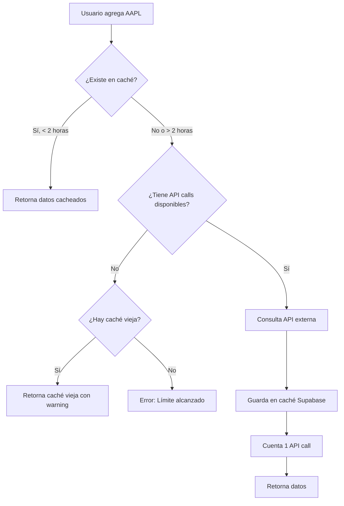
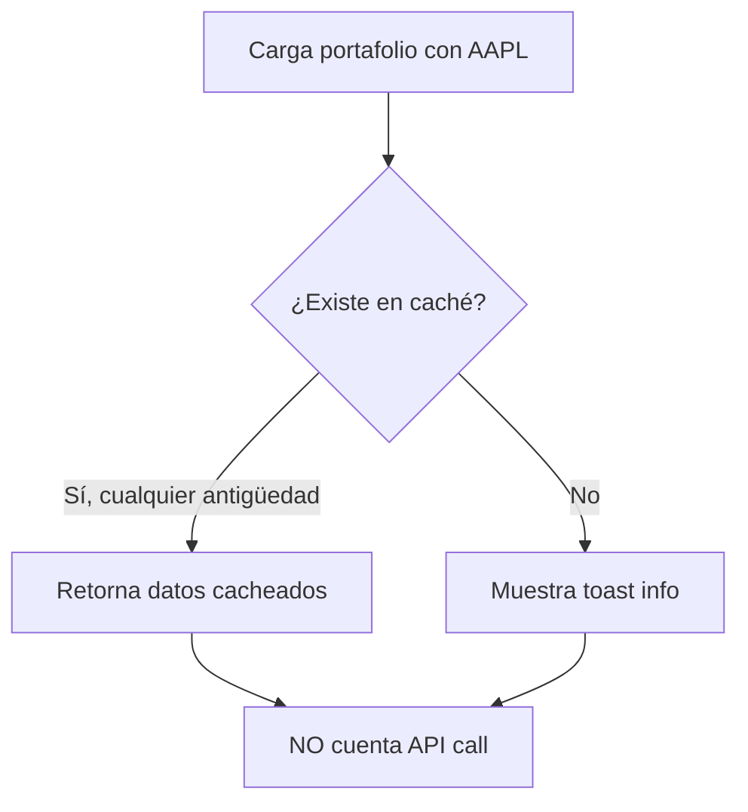

# Optimización de Caché y API Calls

## 📋 Resumen

Este documento explica cómo funciona el sistema de caché optimizado para minimizar el uso de API calls y mejorar la experiencia del usuario.

## 🎯 Problemas Resueltos

### 1. **Activos del Portafolio Consumían API Calls**

**Problema Anterior:**
- Cuando un usuario con un portafolio ingresaba al dashboard, se cargaban automáticamente todos sus activos
- Cada activo contaba como 1 API call, incluso si ya estaban cacheados
- Un usuario con 5 activos en su portafolio consumía 5 API calls solo por entrar al dashboard

**Solución Actual:**
- Los activos cargados desde el portafolio NO cuentan como API calls
- Se usa solo la caché de Supabase (válida por 2 horas)
- Si la caché existe (aunque esté un poco vieja), se usa sin contar API call
- Solo los activos agregados manualmente desde el input consumen API calls

**Implementación:**
```typescript
// dashboard-page.tsx
const portfolioTickersRef = useRef<Set<string>>(new Set());

// Marcar tickers del portafolio
portfolioSymbols.forEach(symbol => {
    portfolioTickersRef.current.add(symbol);
    addTicker(symbol);
});

// Al hacer fetch
const isFromPortfolio = portfolioTickersRef.current.has(ticker);
queryFn: () => fetchTickerData({ 
    queryKey: ['assetData', ticker, config, user, profile],
    fromPortfolio: isFromPortfolio // No cuenta API call
})
```

### 2. **Tiempos de Caché Optimizados**

**Antes:**

| Tipo de Caché | Duración Anterior |
|---------------|-------------------|
| Supabase DB | 1 hora |
| React Query staleTime | 5 minutos |
| React Query gcTime | 15 minutos |

**Ahora:**

| Tipo de Caché | Duración Nueva | Razón |
|---------------|----------------|-------|
| Supabase DB | **2 horas** | Los datos financieros no cambian tan rápido |
| React Query staleTime | **10 minutos** | Reduce refetches innecesarios |
| React Query gcTime | **30 minutos** | Mantiene datos en memoria más tiempo |

**Impacto:**
- ✅ Menos API calls
- ✅ Respuestas más rápidas (datos en caché)
- ✅ Mejor experiencia de usuario
- ✅ Permite trabajar con límite de API más bajo

## 🔄 Flujo de Datos

### Caso 1: Usuario Agrega Ticker Manualmente (Input)



### Caso 2: Usuario Entra con Portafolio (Automático)



## 📊 Ejemplo Práctico

### Escenario: Usuario Plan Básico (5 API calls/día)

**Antes de la optimización:**
```
8:00 AM - Usuario entra al dashboard con 3 activos en portafolio
          → Consume 3 API calls (2 restantes)

10:00 AM - Agrega MSFT manualmente
           → Consume 1 API call (1 restante)

11:00 AM - Agrega GOOGL manualmente  
           → Consume 1 API call (0 restantes)

12:00 PM - Intenta agregar TSLA
           → ❌ ERROR: Límite alcanzado
```

**Después de la optimización:**
```
8:00 AM - Usuario entra al dashboard con 3 activos en portafolio
          → Consume 0 API calls (5 restantes) ✅

10:00 AM - Agrega MSFT manualmente
           → Consume 1 API call (4 restantes)

11:00 AM - Agrega GOOGL manualmente  
           → Consume 1 API call (3 restantes)

12:00 PM - Agrega TSLA manualmente
           → Consume 1 API call (2 restantes) ✅

2:00 PM - Agrega NVDA manualmente
          → Consume 1 API call (1 restante)

4:00 PM - Agrega AMD manualmente
          → Consume 1 API call (0 restantes)
```

## ⚙️ Configuración

### Archivo: `asset-api.ts`

```typescript
// Caché de Supabase
const twoHoursAgo = new Date(Date.now() - 2 * 60 * 60 * 1000);

// Si viene del portafolio, usa caché sin importar antigüedad
if (fromPortfolio && cached?.data) {
    toast.info(`Mostrando datos cacheados para ${ticker} desde tu portafolio.`);
    return cached.data as AssetData;
}
```

### Archivo: `dashboard-page.tsx`

```typescript
staleTime: 1000 * 60 * 10, // 10 minutos
gcTime: 1000 * 60 * 30,    // 30 minutos
```

## 🎯 Beneficios

### Para Usuarios Plan Básico (5 calls/día)
- ✅ Pueden tener 3 activos en portafolio + agregar 5 más manualmente
- ✅ Total: 8 activos analizables vs 5 antes

### Para Usuarios Plan Plus (15 calls/día)
- ✅ Pueden tener 5 activos en portafolio + agregar 15 más
- ✅ Total: 20 activos analizables vs 15 antes

### Para Usuarios Plan Premium (50 calls/día)
- ✅ Pueden tener 10 activos en portafolio + agregar 50 más
- ✅ Total: 60 activos analizables vs 50 antes

## 📝 Notas Importantes

1. **La caché se comparte entre dashboard y otras vistas**
   - Si consultas AAPL en el dashboard, la caché se usa en el portafolio también

2. **Los datos se actualizan cada 2 horas máximo**
   - Para datos más frescos, el usuario puede remover y volver a agregar el ticker

3. **El reseteo diario de contadores es independiente**
   - A medianoche UTC todos los contadores vuelven a 0
   - La caché de Supabase NO se borra (sigue válida por 2 horas desde su creación)

4. **Toast informativos**
   - Usuario ve cuando se usan datos cacheados del portafolio
   - Usuario ve warning cuando alcanza el límite pero hay caché disponible

## 🔮 Mejoras Futuras

- [ ] Botón para "Actualizar datos" manualmente (consume 1 API call)
- [ ] Mostrar en UI cuándo fue la última actualización de cada activo
- [ ] Permitir configurar el tiempo de caché por usuario (premium)
- [ ] Sistema de cola para actualizar activos de mayor a menor prioridad
